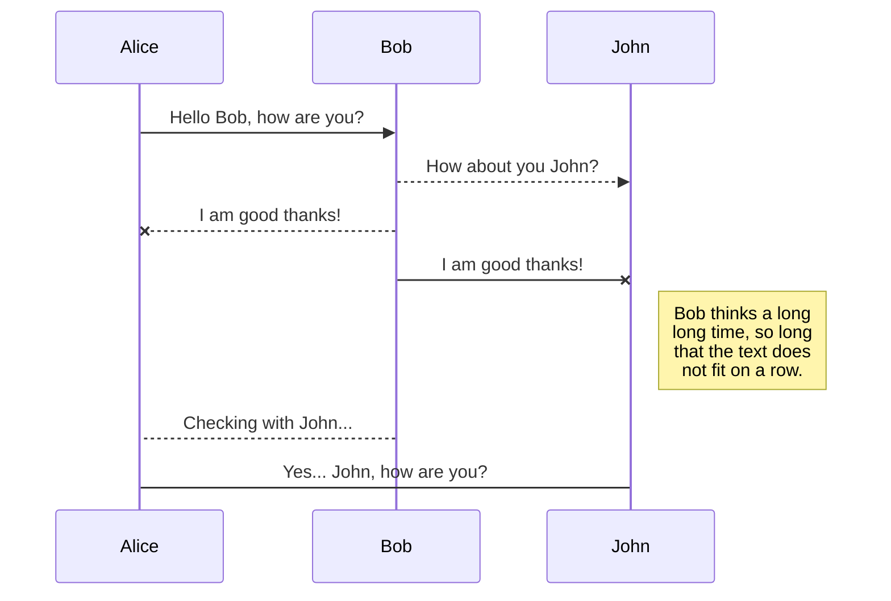
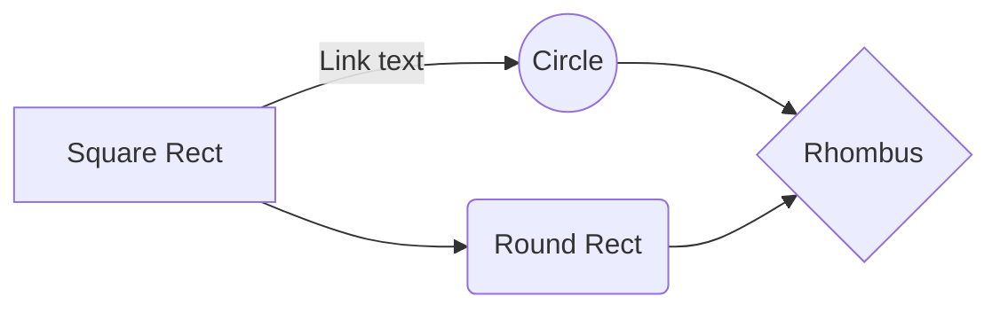

# VPN Sniffer

WIP

## Docker notes

* Remote docker server: tcp://92.222.93.179:4243
** Network interface: ens3
** Run docker with --network="host"

## MongoDB

* 92.222.93.179
* 948eLA$*NyDYD

# Capitrain : Groupe 3 - Alexis Delforges, Ismaïl Ouazzani

## Présentation du projet

Le projet s’articule autour de la problématique du partage de données dans l’Internet d’aujourd’hui et de demain, problématique notamment adressée par l’équipe de recherche STACK de l’IMT Atlantique [1].

Concrètement, il ’agit de mettre en œuvre un utilitaire capable de collecter sur une période prédéfinie la taille, le type, la source/destination et la durée des échanges de données depuis et vers un poste client (i.e., ordinateur, téléphone, etc.). Un tel outil sera utilisé pour extraire, dans un deuxième temps, un modèle statistique des objets manipulés dans les principales applications utilisées de nos jours (instagram, spotify, youtube/netflix, navigateur, e-health, système de géo-localisation, etc.)

 Le travail sera organisé autour des tâches suivantes : 
 — Spécifier l’ensemble des métriques qui doivent être collectées afin de pouvoir en extraire un modèle ; 
 — Développer (ou adapter) une application afin de pouvoir réaliser une collecte centralisée sur au moins deux types de support (ordinateur et téléphone) 
 — Réaliser une première campagne de collecte au travers une base de volontaire. 
 — Analyser les informations collectées afin d’extraire un modèle de la distribution de la taille, du type, de la durée, de la destination des transferts. 

A plus gros grain, ce projet s’insère dans l’initiative DISCOVERY pilotée par l’équipe STACK qui vise à proposer un nouveau gestionnaire de ressources pour les futures infrastructures d’informations et de communications. Le travail réalisé pourra donner lieu à un article de recherche

## Contexte

Le nombre, le type et la taille des objets que nous échangeons via Internet n’ont cessé d’évoluer depuis les années 2000. De “simples” pages HTML qui intégraient pour les plus avancées des CSS et quelques scripts, nous partageons au quotidien et sans nous en rendre compte tout une multitude d’objets complexes et en grand nombre (vidéo/musique à la demande, messagerie instantanée, réseaux sociaux, etc.). Avec l’avènement de l’Internet des Objets, les acteurs des réseaux comme CISCO [2] ont prédit une explosion de ces échanges et ont alertés sur la nécessité de mettre en place rapidement des nouveaux mécanismes capables de répondre à cette demande croissante.

## Problématique 

Depuis 2016, plusieurs systèmes visant à améliorer le partage et l’échange de données pour la prochaine génération d’Internet sont à l’étude [3, 4]. Malheureusement, la validation expérimentale de ces propositions en terme de performance, de passage à l’échelle ou encore d’empreinte écologique, est réalisée en s’appuyant sur des modèles arbitraires construits sur des projections hypothétiques de ce que sont et pourraient être les échanges de données. 

Si des analyses ont été réalisées par exemple pour caractériser le trafic du système youtube (principalement entre 2008 et 2012) ou encore le trafic d’un fournisseur italien [5], il n’existe pas à l’heure actuelle d’outil permettant d’extraire de manière agnostique un modèle des objets échangés pour l’ensemble des applications que nous pouvons utiliser au quotidien.

## Objectif

L’objectif du travail proposé dans ce projet vise à concevoir et développer un outil permettant de collecter des informations relatives à tout type de transfert de données depuis et vers un poste client. Le projet sera articulé autour de six volets (le dernier pouvant être vu comme un bonus) : 
— La lecture et la compréhension d’articles scientifiques et de documentation technique (référencés ci-après) ; 
— La spécification des besoins en fonction des métriques identifiées ; 
— L’étude de l’existant afin d’éviter des développements redondants (il sera par exemple utile d’étudier dans quel mesure tout ou partie d’outils comme network-har associés à des approches par proxy pourraient être utilisés) ; 
— Le développement de l’outil de collecte, incluant la centralisation des informations sur un serveur dédié ; 
— L’exécution d’une première campagne sur un groupe d’utilisateurs restreints ; 
— L’analyse statistique des données collectées ;

## Methodologie

Ce projet sera réalisé suivant une méthode agile avec des réunions à minima tout les 15 jours et un suivi en ligne via l’utilisation de l’etherpad suivant : https://pad.inria.fr/p/np_5tgfsInwLOAWB0aS_CAPITRAIN-2019-2020.

## Présentation de l'équipe 

### Alexis Delforges : 
Apprenti ingénieur logiciel à l'IMT Atlantique et Orange (Labs à Rennes)
-Travaux sur la géolocalisation de trackers GPS LTE-M,
-Applications de réalité virtuelle
-Prochainement en projet de fin d'études sur la construction d'une stack réseau multiplateforme AR/VR

### Ismaïl Ouazzani : 
Apprenti ingénieur logiciel à l'IMT Atlantique et Smart (Nantes
blabla

### Groupe 1 :
Killian Mer et Yanis Telaoumaten

### Groupe 2 :
Guillaume Guirriec et Sebastien Bretaud

## Chronologie

Le projet s'est déroulé avec 3 groupes d'étudiants comme décrit plus haut, encadré par Adrien Lèbre, chercheur à l'IMT Atlantique, équipe STACK.
Le projet a favorisé la collaboration, même si des rendus différents étaient attendus.

### Phase 1 : Exploration

Les groupes ont commencé par une phase d'exploration du sujet et des différentes possibilités de récupérer les paquets réseaux provenant de smartphone et d'ordinateurs.

Nous avons fait le paris de tenter une approche Man-In-The-Middle où un acteur viendrait inspecter tous les paquets entre le client et les serveurs appelés.
Un groupe nous a suivis sur cette approche et un autre s'est penché sur une approche proxy sur smartphone.

Les premiers résultats venant de cette exploration sont :
- Difficulté voir impossibilité de décrypter le traffic HTTPS
- Outil Wireshark permet de sniffer les paquets réseaux, basons-nous sur la librairie de sniffing : Libtins.
- Proxy smartphone est difficile à mettre en place et nécessite de triturer le code source d'une application pour pouvoir décrypter l'HTTPS
- Un reverse DNS (ip --> nom de domaine) sera obligatoire pour trouver le serveur destinataire ou émetteur de donnée et ainsi le relier à une compagnie
- La collaboration entre équipes se passent bien avec un bon échange de procédés et de résultats, tout cela avec une once de compétition bienveillante.

### Phase 2 : Construction de la solution

Nous sommes donc partis sur l'approche Man-In-The-Middle avec une solution fonctionnant sur docker, déployé sur un VPS(serveur privé virtualisé) OVH disposant d'un VPN : OpenVPN.
Concrètement, un utilisateur se connectant sur notre VPN pourra effectuer toutes les actions classiques d'internet, quelque soit son support (smartphone, ordinateur). Durant le transit des packets réseaux, nous les observerons grâce à la librairie libtins en C++ qui permet de regarder l'ensemble des paquets réseaux passant sur une interface réseau (votre carte réseau donc). 
Nous avons également produit un service de ReverseDNS, Mapping de nom de domaine à compagnies, un bus de message et un base non-relationnel (MongoDB).

Les  résultats de cette phase sont :
- Problème de granularité des objets : nous n'avons que des paquets réseaux dont la taille maximale défini par le protocol IP. Nous ne pouvons pas dire quel requête a engendré quel traffic réseaux.
- L'approche proxy smartphone est un échec à cause du SSL pinning des applications natifs qui rend le proxy inutilisable. La dernière solution est de triturer le code source des applications pour trouver la librairie réseaux et la changer par un autre ( technique LD_PRELOAD [6] ). Le groupe 1 abandonne et reprend la méthode Man-In-The-Middle avec la libraire PyShark (utilise les libraires de Wireshark en wrappant en Python)
- Reverse DNS fonctionne dans 70% des cas (outils payant plus performants existants)
- Mapper un nom de domaine avec une compagnie est difficile car elles se cachent derrière des cdn avec des noms de domaines peu évocateurs
- Le moral est bas car nous ne pensons pas pouvoir avoir la granularité demandée

### Phase 3 : Autre vision et premiers résultats

Les équipes changent leur fusil d’épaule:
- On fait tourner notre VPN sur vos applications/devices (OpenVPN sur un VPS pour 2 groupes dont le notre)
- On récupère les logs et on fait une analyse de ces derniers (RStudio pour notre groupe, MongoChart pour le groupe 1)
- Representation des données échangées en UP et DOWN en moyenne, par application, par stream (notamment rassembler par fenêtre temporelle)

Nous avons rassemblé nos éléments déjà développé pour construire la stack suivante :
- Le VPS sniffe les paquets réseaux et les trie par type (UDP, TCP, autres) et rempli un fichier texte au fil du temps
- On récupère le fichier à la main sur le Docker pour le parser avec un programme Js et avoir le reverseDNS, et le ré-assemblage des paquets par streams.
- Le fichier généré par le programme JS est ensuite donné à RStudio où un script met en forme toutes les données (génération de graphes et de métriques)
- Les 3 groupes sont arrivés à avoir un système qui traite les données, certains sont plus automatisés que le notre (MongoDB+Mongo Chart) mais offre moins de métriques. La visualisation des données est très différentes en fonction des groupes.
- La collaboration reste une priorité pour comparer nos données et vérifiés le bon fonctionnement de nos systèmes 

### Phase 4 : Analyses des résultats et corrections

## Liste Applications Analysées

- Video/Streaming

-   + Youtube

-   + Netlix

-   + Spotify

-   + Deezer

- Geostation

-   + Waze

-   + GoogleMaps

-   - Messengers

+ What'sapp (ou un autre messenger)

+ Gmail/Outlook 

+ Drive

+ Messenger

- Réseaux sociaux

+ Instagram

+ Twitter

+ Snapchat

+ Facebook

## Bibliographie 

[1] http ://stack.inria.fr 
[2] https ://www.cisco.com/c/fr_fr/solutions/service-provider/visual-networkingindex-vni/index.html 
[3] Bastien Confais, Adrien Lebre, Benoît Parrein. An Object Store Service for a Fog/Edge Computing Infrastructure based on IPFS and Scale-out NAS. 1st IEEE International Conference on Fog and Edge Computing - ICFEC’2017, May 2017, Madrid, Spain. pp.41-50 
[4] Gheorghe, Alin-Gabriel, et al. "Decentralized Storage System for Edge Computing." 2019 18th International Symposium on Parallel and Distributed Computing (ISPDC). IEEE, 2019. 
[5] Trevisan, Martino, et al. "Five years at the edge : watching internet from the ISP network." Proceedings of the 14th International Conference on emerging Networking EXperiments and Technologies. ACM, 2018
[6] Dynamic linker tricks: Using LD_PRELOAD to cheat, inject features and investigate programs,https://rafalcieslak.wordpress.com/2013/04/02/dynamic-linker-tricks-using-ld_preload-to-cheat-inject-features-and-investigate-programs ,  April 2, 2013, Rafał Cieślak -

## UML diagrams

You can render UML diagrams using [Mermaid](https://mermaidjs.github.io/). For example, this will produce a sequence diagram:

And this will produce a flow chart:

